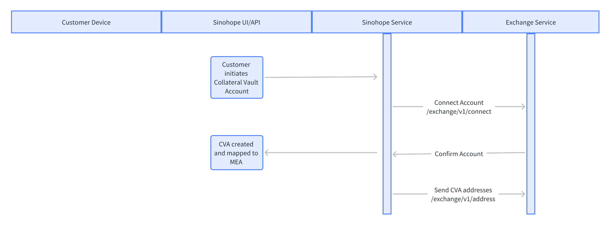
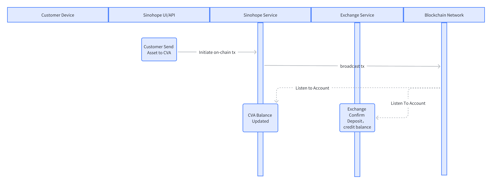
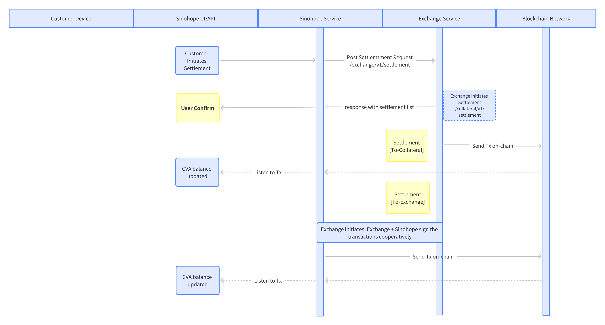
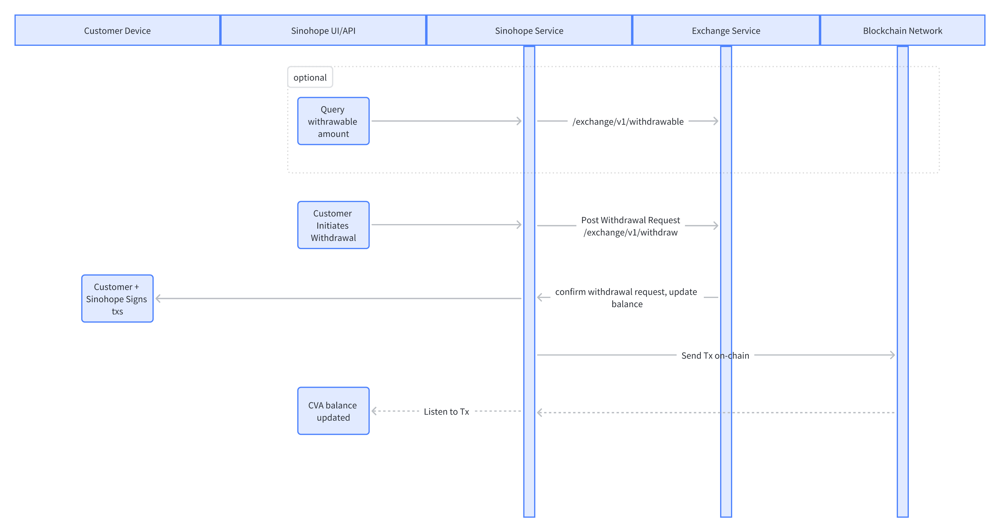

# Changelog

Changes log, dates are displayed in UTC, shows in a reverse order.

### v0.9.12
> 2023/06/28 by Darlzan

- `/collateral/v1/settlement/tx/build` : update the response.

### v0.9.11
> 2023/06/16 by Darlzan

- E-custody `/internal/v1/mpc/start` : add fields `transactionId`.

### v0.9.10
> 2023/06/14 by Darlzan

- `/collateral/v1/settlement/address` : new added api.
- `/collateral/v1/settlement/finish` : new added api.

### v0.9.9
> 2023/06/06 by Darlzan

- `/collateral/v1/settlement/tx/build` : add fields `cryptography` in the response.
- `/collateral/v1/settlement/tx/broadcast` : update single fields `signature` to object type fields `signatures`, in order to adapt to the UTXO transactions.

### v0.9.8
> 2023/06/01 by Darlzan

- `/exchange/v1/mpc/pubkey` :contains two public keys, ecdsa-secp256k1 public key and eddsa-ed25519 public key.
- `/exchange/v1/settlement/confirm` : add fields `approved`.

### v0.9.7
> 2023/05/30 by Darlzan

- `/exchange/v1/deposit` : new added.
- `/collateral/v1/deposit/balance` : new added.
- `/exchange/v1/withdrawable`: change the type of the fields `amount` in response data from `number` to `string`.

### v0.9.6
> 2023/05/30 by Darlzan

- `/exchange/v1/settlement/network` : change fields name `perferedNetwork` to `settlementNetwork`

### v0.9.5
> 2023/05/26 by Darlzan

- `/exchange/v1/mpc/join` and `/internal/v1/mpc/join`: add fields `roomId`, `partyId`, `partyIds`.
- `/exchange/v1/settlement/list` and `/collateral/v1/settlement`: fix typo, `assetid` -> `assetId`.
- add some examples, fix some descriptions.

### v0.9.4
> 2023/05/18 by Darlzan

- `/exchange/v1/settlement/network`: The settlement network should be specified for a currency, so change the field `assetId` to `currency`.
- Added new apis in the Exchange: `/exchange/v1/transaction/status` and `/exchange/v1/withdrawable`.
- `/collateral/v1/settlement/tx/build` : add feild `replacedTxId`.
- `/internal/v1/mpc/signature/result` and `/collateral/v1/settlement/tx/broadcast`: modify the fields about signature.
- modify the description of `/collateral/v1/transactions`.

### v0.9.3
> 2023/05/12 by Darlzan

- `/exchange/v1/address` : add request feild `settlementNetwork`.
- `/collateral/v1/settlement/tx/build` : remove feilds `network`, `address` in request, they should be determined by the settlement details.
- add security section for all "Exchange->Custody" apis.

### v0.9.2
> 2023/05/04 by Darlzan

- add apis related to mpc business

### v0.9.1
> 2023/03/24 by Kevin

Second working version.
### v0.9.0
> 2023/03/12 by Kevin

First version

# Glossary

Roles: User U, Exchange E, Custodian Platform C.

Main Exchange Account: Abbreviated as MEA. It is an account opened by user U on exchange E, usually identified by an API key.

Collateral Vault Account: Abbreviated as CVA. When user U needs to map assets to exchange E, a CVA is created on custodian platform C. CVA is one-to-one mapped with MEA. The unique ID of CVA is collateralId.

# Main Steps

## Initiate

## Deposit

## Settlement

## Withdrawal

# Response code definition

Commonly, for all APIs, the HTTP status codes should use those registered by IANA.
See: <https://www.iana.org/assignments/http-status-codes/http-status-codes.xhtml>

In OpenLoop, we should use a few well defined HTTP status codes as follow:

- `200`: Successful response. Refer to each API for the detailed response data.
- `400`: Return Bad Request.
- `401`: Unauthorized. Either API details are missing or invalid
- `403`: Forbidden - You do not have access to the requested resource.
- `415`: Unsupported media type. You need to use application/json.
- `500`: Exchange/SinoHope internal error.
